# Electrium Mobility 2026 ESC
This repository contains all the firmware and hardware for Electrium Mobility's 2026 ESC, which is a 36V/15A 3-phase BLDC motor controller built around the STSPIN32G4 SiP's integrated gate driver and STM32G4 MCU, supporting 6-step commutation and FOC!

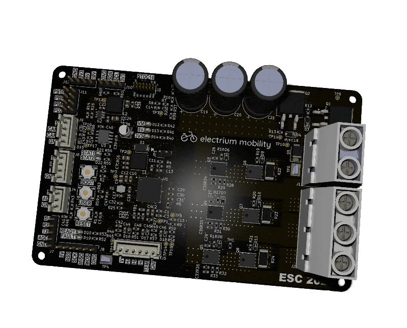 

## Architecture
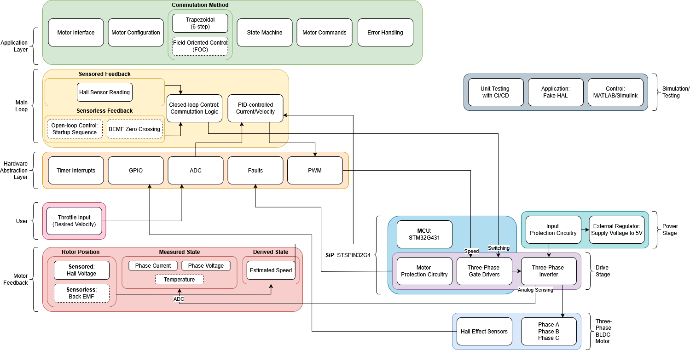

## Features

### Power
- **Voltage**: 10-36V (maximum 10S battery pack)
- **Current**: 15A continuous (25A peak)
- **Power**: 500W (implied by above)
- External 5V/1A Buck Regulator
- Internal VCC (using 10V)/200mA Buck Regulator
- Internal 3.3V/150mA LDO
- 1410uF Bulk Capacitor Bank (bleed resistor discharges it in 1 min)

### Input Protection
- Reverse Polarity Protection (dual back-to-back PMOS)
- Inrush Current Limiting (RC soft-start)
- Transient Overvoltage Protection (60V TVS clamp)
- Short-circuit and Overcurrent Protection (SCREF divider)

### Sensing
- Phase Currents (0.5m shunt resistors) using Internal PGA with Overcurrent Protection (note: measures negative currents, but regenerative braking is not supported)
- Phase Voltages (for sensorless feedback method using BEMF zero-crossings)
- PCB Temperature (NTC thermistor)

### Interfaces
- Power Supply Input (VM+, VM-)
- SWD Programming/Debug (STDC14)
- **Throttle**: UART (digital commands), ADC (analog pot)
- **Motor**: Phase Outputs (U, V, W), Hall Sensors (A, B, C), Winding Temperature
- CAN (FD)
- Expansion Headers: SPI, I2C, 4 unused pins

### User I/O
- **Buttons**: RESET, BOOT, USER
- **LEDs**: Power Rails, READY, FAULT, 2 configurable (STATUS1, STATUS2)
- Onboard Test Points

### Board 
- 4-layer (stackup: Signal/Power, Ground, Ground, Signal)
- 125x80mm with 2oz Outer and 0.5oz Inner Copper
- Partitioned Grounding Scheme (separates high-power PGND and logic GND)

## Schematic
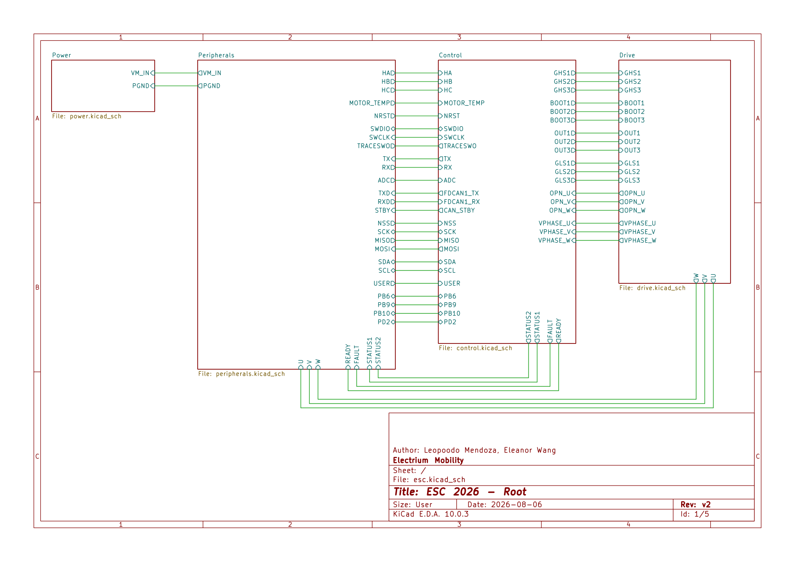 

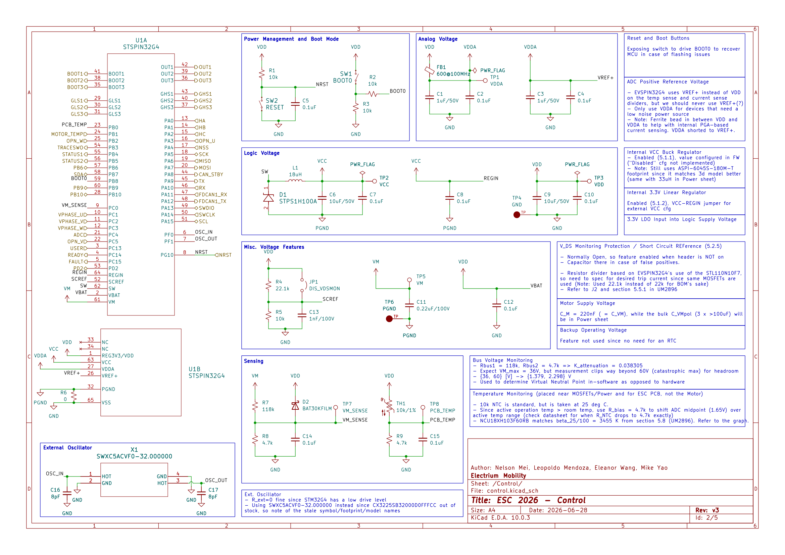 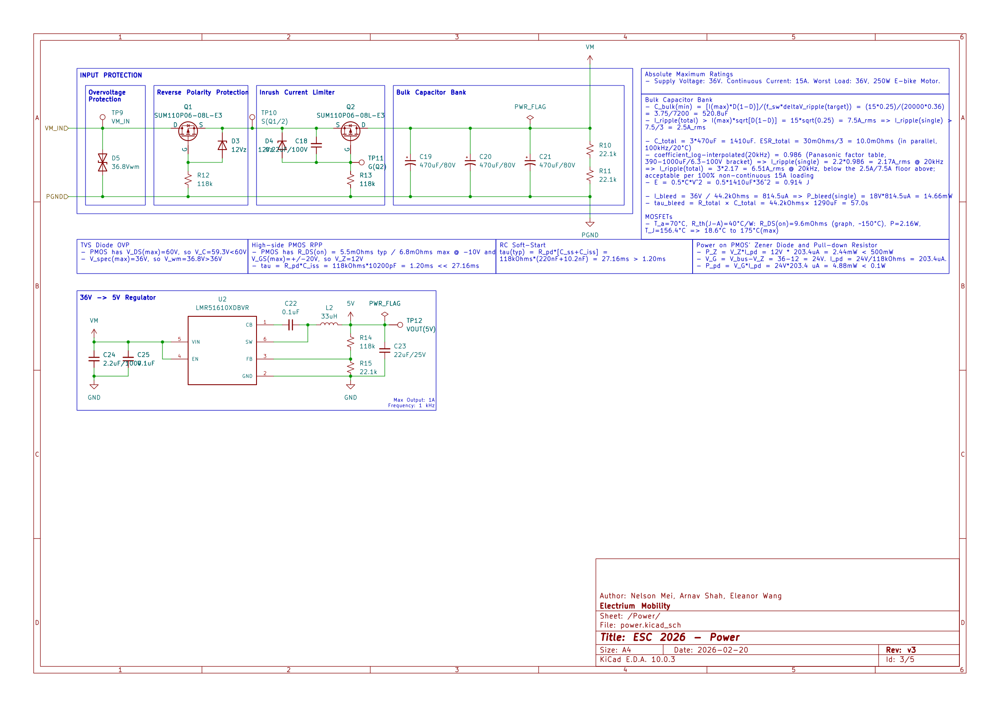 
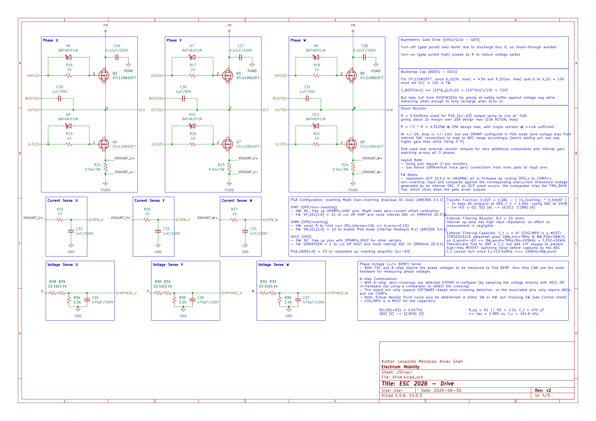 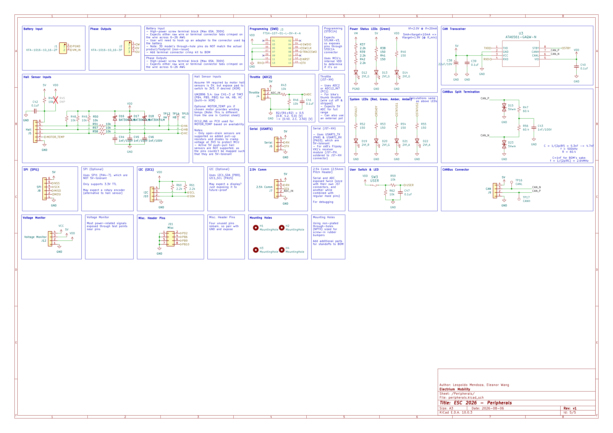 

## Routing

### Coloured (Traces Only, With Zones and Silkscreen)
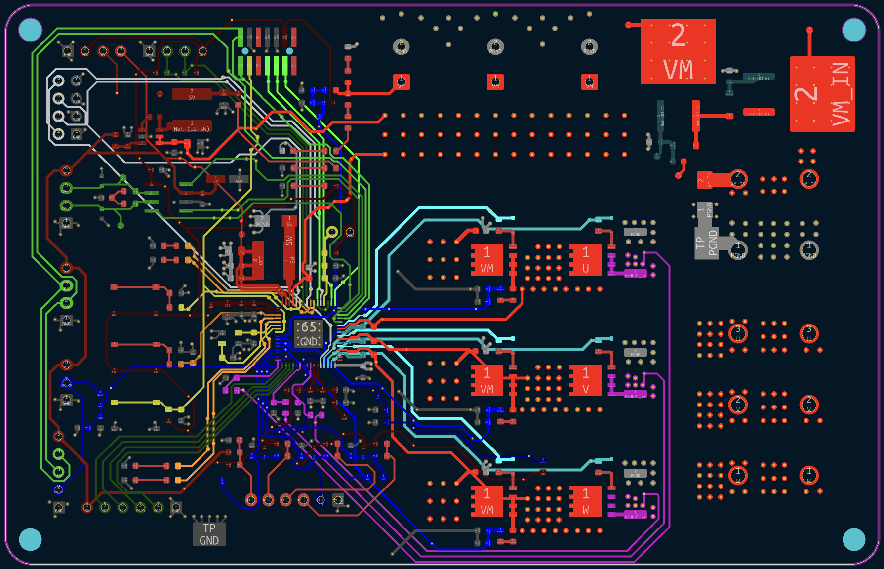 
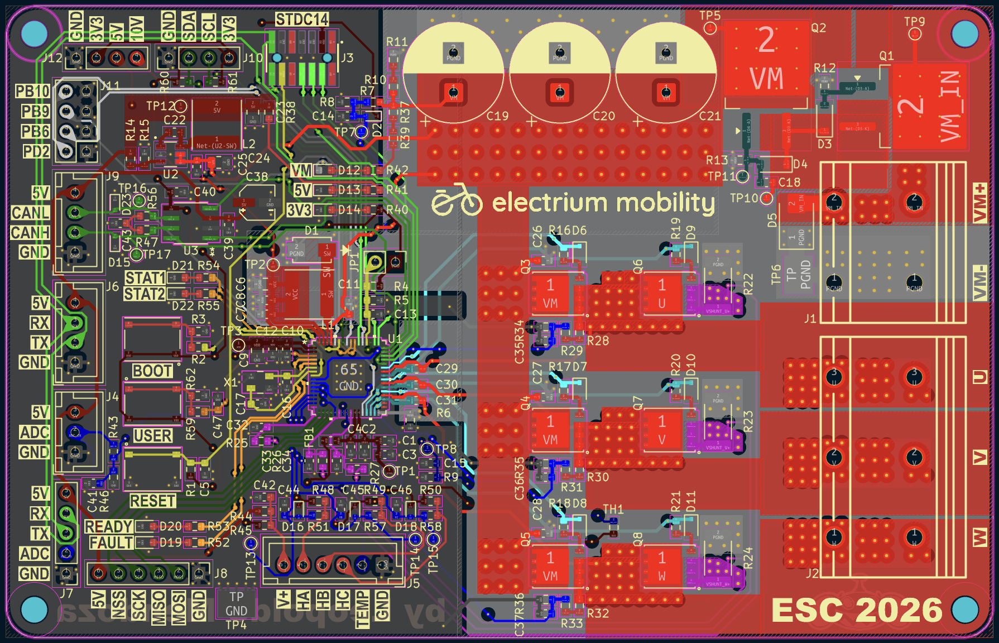 

### Colourless (Traces Only, With Zones and Silkscreen)
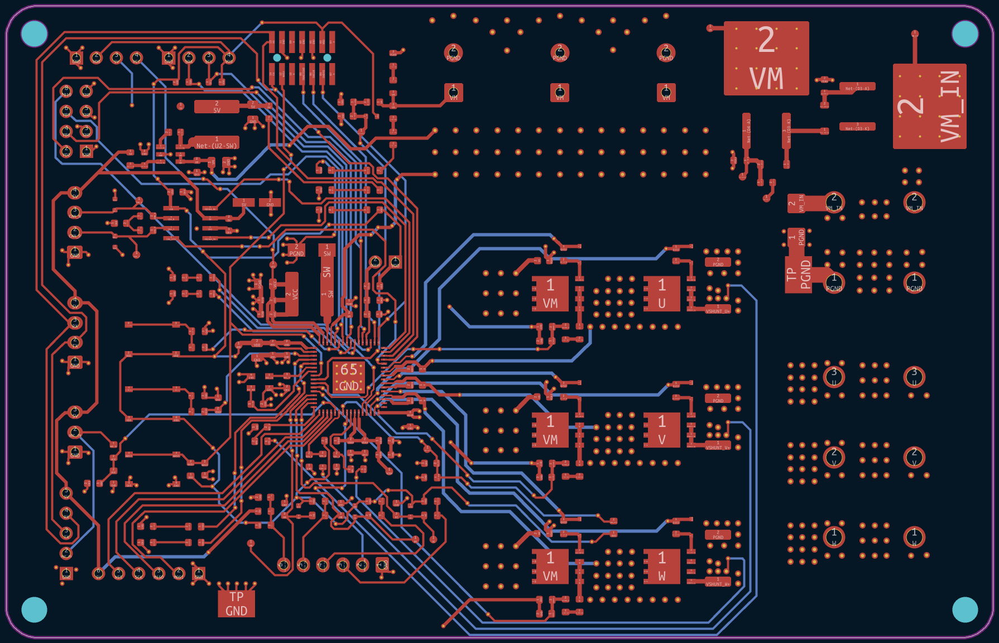 
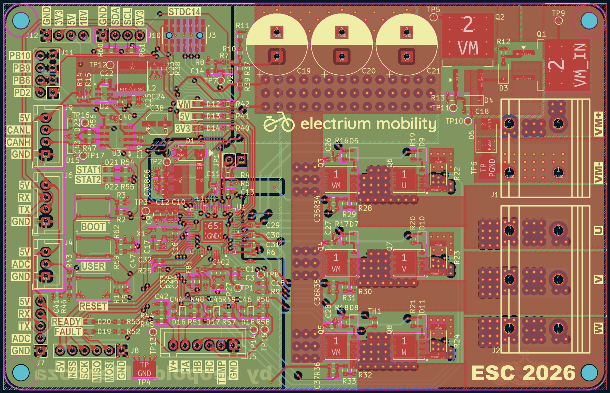 

## 3D Renders
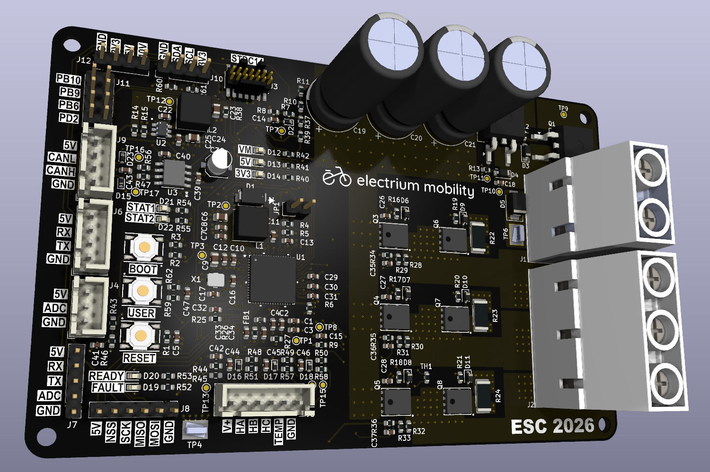 
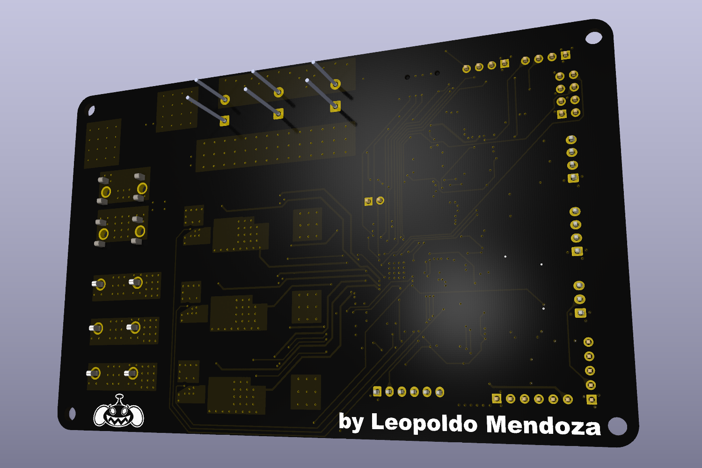 

## Assembled Board
⚠️Under Construction⚠️
